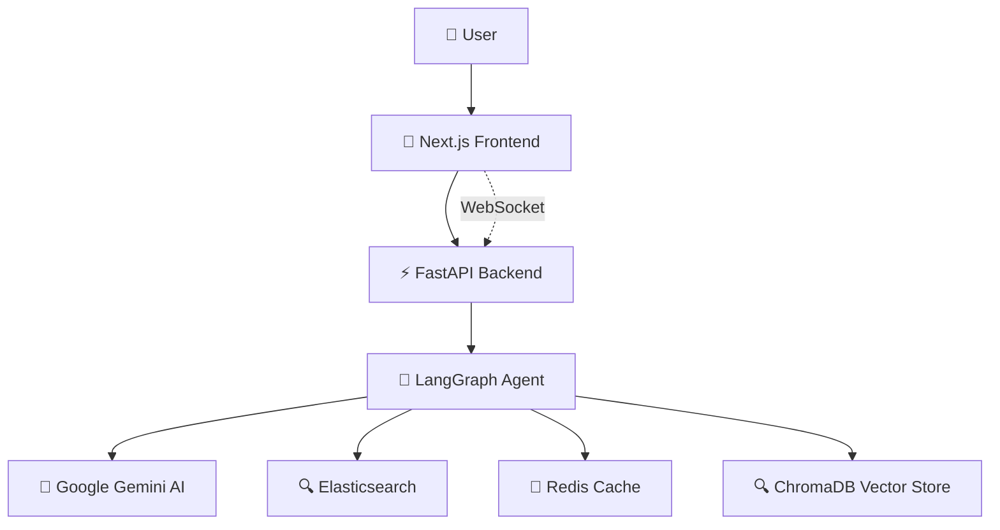

# 🚀 Elasticsearch Agent

> **AI-Powered Elasticsearch Data Analysis & Visualization Platform**

[](https://www.python.org/downloads/)
[](https://fastapi.tiangolo.com/)
[](https://nextjs.org/)
[](https://opensource.org/licenses/MIT)

Transform your Elasticsearch data into actionable insights through natural language conversations. This intelligent agent combines the power of **LangGraph**, **Google Gemini AI**, and **modern web technologies** to create an intuitive interface for data exploration and visualization.


## ✨ Key Features

### 🧠 **Intelligent Query Processing**
- **Natural Language Understanding**: Ask questions in plain English
- **Context-Aware Conversations**: Remembers previous interactions
- **Smart Query Generation**: Automatically creates optimized Elasticsearch queries
- **Semantic Search**: Learns from successful queries for better responses

### 📊 **Advanced Visualizations**
- **Dynamic Chart Generation**: Automatic chart type selection based on data
- **Interactive Dashboards**: Real-time updates with WebSocket connections
- **Multi-Chart Support**: Bar, line, pie, and custom visualizations
- **Smart Field Mapping**: Intelligent axis and data field suggestions

### ⚡ **High Performance**
- **Vector-Based Learning**: ChromaDB for semantic query matching
- **Intelligent Caching**: Redis-powered query and session caching
- **Real-Time Updates**: Live data synchronization via WebSockets
- **Optimized Stack**: UV (10-100x faster Python deps) + Bun (5x faster JS runtime)

### 🔧 **Enterprise Ready**
- **Scalable Architecture**: Microservices with FastAPI backend
- **Error Handling**: Comprehensive error recovery and user feedback
- **Health Monitoring**: Built-in service health checks
- **Development Tools**: Hot reload, comprehensive testing, and debugging

## 🎯 Use Cases

- **📈 Business Analytics**: "Show me sales trends by region this quarter"
- **🔍 Log Analysis**: "Find all errors in the last 24 hours"
- **📊 Data Exploration**: "Create a pie chart of user segments"
- **🚨 Monitoring**: "What's the average response time today?"
- **💡 Insights Discovery**: "Show me the top performing products"

## 🚀 Quick Start

### Prerequisites

- Python 3.11+
- Node.js 18+ (or Bun)
- Docker & Docker Compose
- [Google Gemini API Key](https://ai.google.dev/) (Free tier available)

### 1. Clone & Setup

```bash
git clone https://github.com/yourusername/elasticsearch_agent.git
cd elasticsearch_agent

# Generate environment files
./scripts/setup-env.sh generate
./scripts/setup-env.sh create

# Configure your API key
nano .env
# Set: GOOGLE_API_KEY=your_actual_gemini_api_key_here
```

### 2. Start Infrastructure

```bash
# Launch Elasticsearch & Redis
docker-compose up -d

# Verify services
docker-compose ps
```

### 3. Launch Backend

```bash
cd backend

# Install UV (ultra-fast Python package manager)
curl -LsSf https://astral.sh/uv/install.sh | sh

# Install dependencies & start server
uv sync
uv run uvicorn main:app --reload --host 0.0.0.0 --port 8000
```

### 4. Launch Frontend

```bash
cd frontend

# Install Bun (if not installed)
curl -fsSL https://bun.sh/install | bash

# Install dependencies & start dev server
bun install
bun dev
```

### 5. Access Application

- 🌐 **Frontend**: http://localhost:3000
- 🔧 **API Docs**: http://localhost:8000/docs
- 🗄️ **Elasticsearch**: http://localhost:9200

## 🏗️ Architecture



### 🔧 Tech Stack

| Component | Technology | Purpose |
|-----------|------------|----------|
| **AI Agent** | [LangGraph](https://www.langchain.com/langgraph) | Workflow orchestration |
| **LLM** | [Google Gemini](https://ai.google.dev/) | Natural language processing |
| **Vector DB** | [ChromaDB](https://www.trychroma.com/) | Semantic search & learning |
| **Cache** | [Redis](https://redis.io/) | Query caching & sessions |
| **Search Engine** | [Elasticsearch](https://www.elastic.co/) | Data storage & retrieval |
| **Backend** | [FastAPI](https://fastapi.tiangolo.com/) | API server |
| **Frontend** | [Next.js](https://nextjs.org/) + [TailwindCSS](https://tailwindcss.com/) | Web interface |
| **Charts** | [Apache ECharts](https://echarts.apache.org/) | Data visualization |
| **State** | [Zustand](https://zustand-demo.pmnd.rs/) | Client state management |
| **Package Managers** | [UV](https://github.com/astral-sh/uv) + [Bun](https://bun.sh/) | Ultra-fast dependency management |

## 💬 Example Conversations

**User**: "Show me all data"
**Agent**: *Displays all available data with smart pagination*

**User**: "Create a bar chart of sales by region"
**Agent**: *Generates optimized ES query → Creates interactive bar chart*

**User**: "What's the total revenue this month?"
**Agent**: *Performs aggregation query → Returns formatted result*

**User**: "Show me errors from the last hour"
**Agent**: *Filters logs by timestamp and error level → Displays results*

## 📁 Project Structure

```
elasticsearch_agent/
├── 🖥️ backend/                 # FastAPI backend
│   ├── app/
│   │   ├── agents/             # LangGraph agents
│   │   ├── services/           # ES, Redis, AI services
│   │   ├── api/               # REST & WebSocket routes
│   │   ├── models/            # Pydantic models
│   │   ├── core/              # Config & dependencies
│   │   └── utils/             # Helper functions
│   ├── scripts/               # Utility scripts
│   ├── tests/                 # Test suite
│   └── pyproject.toml         # Python dependencies
├── 🎨 frontend/                # Next.js frontend
│   ├── src/
│   │   ├── components/        # React components
│   │   ├── app/              # Next.js app router
│   │   ├── hooks/            # Custom React hooks
│   │   ├── store/            # Zustand stores
│   │   └── types/            # TypeScript definitions
│   └── package.json          # Node.js dependencies
├── 🗂️ docs/                   # Documentation
├── 🔧 scripts/                # Setup & utility scripts
├── 🐳 docker-compose.yml      # Infrastructure setup
└── 📋 README.md               # This file
```

## 🧪 Testing & Development

### Health Check
```bash
curl http://localhost:8000/api/v1/health
```

### Sample Data
```bash
cd backend
uv run python scripts/ingest_sample_data.py
```

### Run Tests
```bash
# Backend tests
cd backend
uv run pytest

# Frontend tests
cd frontend
bun test
```

## 🚀 Deployment

### Development
- **Frontend**: `bun dev` (with hot reload)
- **Backend**: `uv run uvicorn main:app --reload`

### Production
- **Frontend**: Deploy to [Vercel](https://vercel.com/)
- **Backend**: Deploy to [Railway](https://railway.app/) or similar
- **Infrastructure**: Managed Elasticsearch + Redis services

## 📈 Performance Benefits

| Tool | Speed Improvement | Benefits |
|------|------------------|----------|
| **UV** | 10-100x faster than Poetry | Lightning-fast Python installs |
| **Bun** | 5x faster than npm | All-in-one JS runtime & bundler |
| **ChromaDB** | Vector similarity search | Intelligent query learning |
| **Redis** | In-memory caching | Sub-millisecond response times |

## 🤝 Contributing

1. Fork the repository
2. Create a feature branch (`git checkout -b feature/amazing-feature`)
3. Commit changes (`git commit -m 'Add amazing feature'`)
4. Push to branch (`git push origin feature/amazing-feature`)
5. Open a Pull Request

## 📄 License

MIT License - see [LICENSE](LICENSE) file for details.

## 🙏 Acknowledgments

- [LangGraph](https://www.langchain.com/langgraph) for workflow orchestration
- [Google Gemini](https://ai.google.dev/) for AI capabilities
- [Elasticsearch](https://www.elastic.co/) for search and analytics
- [FastAPI](https://fastapi.tiangolo.com/) for the robust API framework
- [Next.js](https://nextjs.org/) for the modern frontend framework

---

<div align="center">

**[🌟 Star this project](https://github.com/yourusername/elasticsearch_agent)** • **[📖 Read the docs](docs/)** • **[🐛 Report issues](https://github.com/yourusername/elasticsearch_agent/issues)**

*Built with ❤️ by [Hieu Nguyen](https://github.com/yourusername)*

</div>
