# 🚀 Elasticsearch Agent

> **AI-Powered Elasticsearch Data Analysis & Visualization Platform**

[](https://www.python.org/downloads/)
[](https://fastapi.tiangolo.com/)
[](https://nextjs.org/)
[](https://opensource.org/licenses/MIT)
[](plan.md)
[](plan.md)

**Transform your Elasticsearch data into actionable insights through natural language conversations.** This intelligent agent combines the power of **LangGraph**, **Google Gemini AI**, and **modern web technologies** to create an intuitive interface for data exploration and visualization.

> 🎯 **Vision**: An AI agent that understands 80% of natural language queries and automatically generates appropriate visualizations - making Elasticsearch accessible to everyone, from business analysts to data scientists.


## 📊 **Current Status** 

| **Phase** | **Status** | **Completion** | **Key Features** |
|-----------|------------|----------------|------------------|
| 🚀 **Phase 1: MVP** | ✅ Complete | **95%** | Chat interface, basic queries, 5 chart types |
| ⚡ **Phase 2: Intelligence** | 🚧 In Progress | **70%** | Vector search, smart recommendations, memory |
| 🎨 **Phase 3: Advanced** | 📋 Planned | **0%** | Complex visualizations, real-time, geo charts |
| 🔧 **Phase 4: Production** | 📋 Planned | **0%** | Performance optimization, deployment, monitoring |

**🎉 Ready for Demo**: The core MVP is functional with comprehensive error handling, WebSocket real-time communication, and ECharts visualization. Only requires a real Google Gemini API key for full functionality.

## ✨ Key Features

### 🧠 **Intelligent Query Processing**
- **Natural Language Understanding**: Ask questions in plain English
- **Context-Aware Conversations**: Remembers previous interactions
- **Smart Query Generation**: Automatically creates optimized Elasticsearch queries
- **Semantic Search**: Learns from successful queries for better responses

### 📊 **Advanced Visualizations**
- **Dynamic Chart Generation**: Automatic chart type selection based on data
- **Interactive Dashboards**: Real-time updates with WebSocket connections
- **Multi-Chart Support**: Bar, line, pie, and custom visualizations
- **Smart Field Mapping**: Intelligent axis and data field suggestions

### ⚡ **High Performance**
- **Vector-Based Learning**: ChromaDB for semantic query matching
- **Intelligent Caching**: Redis-powered query and session caching
- **Real-Time Updates**: Live data synchronization via WebSockets
- **Optimized Stack**: UV (10-100x faster Python deps) + Bun (5x faster JS runtime)

### 🔧 **Enterprise Ready**
- **Scalable Architecture**: Microservices with FastAPI backend
- **Error Handling**: Comprehensive error recovery and user feedback
- **Health Monitoring**: Built-in service health checks
- **Development Tools**: Hot reload, comprehensive testing, and debugging

## 🎯 Use Cases

- **📈 Business Analytics**: "Show me sales trends by region this quarter"
- **🔍 Log Analysis**: "Find all errors in the last 24 hours"
- **📊 Data Exploration**: "Create a pie chart of user segments"
- **🚨 Monitoring**: "What's the average response time today?"
- **💡 Insights Discovery**: "Show me the top performing products"

## 🚀 Quick Start

### Prerequisites

- Python 3.11+
- Node.js 18+ (or Bun)
- Docker & Docker Compose
- [Google Gemini API Key](https://ai.google.dev/) (Free tier available)

### 1. Clone & Setup

```bash
git clone https://github.com/yourusername/elasticsearch_agent.git
cd elasticsearch_agent

# Generate environment files
./scripts/setup-env.sh generate
./scripts/setup-env.sh create

# Configure your API key
nano .env
# Set: GOOGLE_API_KEY=your_actual_gemini_api_key_here
```

### 2. Start Infrastructure

```bash
# Launch Elasticsearch & Redis
docker-compose up -d

# Verify services
docker-compose ps
```

### 3. Launch Backend

```bash
cd backend

# Install UV (ultra-fast Python package manager)
curl -LsSf https://astral.sh/uv/install.sh | sh

# Install dependencies & start server
uv sync
uv run uvicorn main:app --reload --host 0.0.0.0 --port 8000
```

### 4. Launch Frontend

```bash
cd frontend

# Install Bun (if not installed)
curl -fsSL https://bun.sh/install | bash

# Install dependencies & start dev server
bun install
bun dev
```

### 5. Access Application

- 🌐 **Frontend**: http://localhost:3000
- 🔧 **API Docs**: http://localhost:8000/docs
- 🗄️ **Elasticsearch**: http://localhost:9200

## 🏗️ Architecture

### **🎯 High-Level System Design**

```mermaid
graph TB
    %% User Interface Layer
    A["👤 User Chat Input"] --> B["🧠 LangGraph Agent Router"]
    B --> C["🔍 Query Parser & Validator"]
    B --> D["📊 Chart Recommendation Engine"]
    
    %% Core Processing
    C --> E["🔗 Elasticsearch Service"]
    E --> F["📈 Data Aggregator"]
    F --> G["🎨 Chart Generator"]
    D --> G
    
    %% Output Layer
    G --> H["⚙️ ECharts Config"]
    H --> I["🌐 Next.js Frontend"]
    
    %% Memory & Intelligence Layer
    J["💾 Redis Memory"] --> B
    K["🧮 Chroma Vector DB"] --> C
    L["🤖 Google Gemini API"] --> D
    
    %% Styling for both light and dark modes
    classDef input fill:#1976d2,stroke:#0d47a1,stroke-width:2px,color:#ffffff
    classDef processing fill:#7b1fa2,stroke:#4a148c,stroke-width:2px,color:#ffffff
    classDef output fill:#388e3c,stroke:#1b5e20,stroke-width:2px,color:#ffffff
    classDef memory fill:#f57c00,stroke:#e65100,stroke-width:2px,color:#ffffff
    
    class A input
    class B,C,D,E,F,G processing
    class H,I output
    class J,K,L memory
```



### **🔄 Detailed Implementation Architecture**

```mermaid
graph TB
    %% Frontend Layer
    User["👤 User"] --> Chat["💬 Chat Interface"]
    Chat --> Store["🏪 Zustand Store"]
    Chat --> WS["🔌 WebSocket Hook"]
    Chat --> API["📡 REST API Client"]
    
    %% Communication Protocols
    WS -.->|Real-time| WSHandler["🔄 WebSocket Handler"]
    API -.->|HTTP/REST| Routes["🛣️ API Routes"]
    
    %% Backend Entry Points
    WSHandler --> DI["💉 Dependency Injection"]
    Routes --> DI
    
    %% Core Services (Managed by DI)
    DI --> Agent["🧠 LangGraph Agent Router"]
    DI --> Parser["🔍 Query Parser & Validator"]
    DI --> Recommender["📊 Chart Recommendation Engine"]
    DI --> ES_Service["🔗 Elasticsearch Service"]
    DI --> Aggregator["📈 Data Aggregator"]
    DI --> Generator["🎨 Chart Generator"]
    
    %% Agent Workflow (LangGraph State Machine)
    Agent --> GetIndices["📋 Get Indices"]
    GetIndices --> AnalyzeIntent["🎯 Analyze Intent"]
    AnalyzeIntent --> Parser
    Parser --> GenerateQuery["📝 Generate Query"]
    GenerateQuery --> ES_Service
    ES_Service --> Aggregator
    Aggregator --> Generator
    Generator --> Response["📤 Generate Response"]
    
    %% Memory & Intelligence Integration
    Redis["💾 Redis Memory"] --> Agent
    Chroma["🧮 Chroma Vector DB"] --> Parser
    Gemini["🤖 Google Gemini API"] --> Recommender
    
    %% External Services
    ES_Service --> ES["🗄️ Elasticsearch Cluster"]
    Generator --> ECharts["⚙️ ECharts Config"]
    ECharts --> Frontend["🌐 Next.js Frontend"]
    
    %% Infrastructure
    ES --> Docker1["🐳 Docker Container"]
    Redis --> Docker2["🐳 Docker Container"]
    
    %% Dark mode compatible styling
    classDef frontend fill:#1976d2,stroke:#0d47a1,stroke-width:2px,color:#ffffff
    classDef backend fill:#7b1fa2,stroke:#4a148c,stroke-width:2px,color:#ffffff
    classDef agent fill:#388e3c,stroke:#1b5e20,stroke-width:2px,color:#ffffff
    classDef external fill:#f57c00,stroke:#e65100,stroke-width:2px,color:#ffffff
    classDef infrastructure fill:#455a64,stroke:#263238,stroke-width:2px,color:#ffffff
    
    class User,Chat,Store,WS,API,Frontend frontend
    class WSHandler,Routes,DI,ES_Service,Aggregator,Generator backend
    class Agent,Parser,Recommender,GetIndices,AnalyzeIntent,GenerateQuery,Response agent
    class ES,Gemini,Redis,Chroma,ECharts external
    class Docker1,Docker2 infrastructure
```



### 🔄 **Detailed Flow Explanation**

#### **Frontend Architecture**
- **Chat Interface**: React component managing user interactions
- **Zustand Store**: Client-side state management for messages, sessions, and connection status
- **WebSocket Hook**: Real-time bidirectional communication with auto-reconnection
- **REST API Client**: Fallback HTTP communication with error handling

#### **Backend Architecture**
- **Dependency Injection**: Centralized service management and health monitoring
- **WebSocket Handler**: Real-time message processing with typing indicators
- **API Routes**: RESTful endpoints for HTTP-based operations
- **Service Layer**: Abstracted external service integrations

#### **LangGraph Agent Workflow**
1. **Get Indices**: Retrieve available Elasticsearch indices
2. **Analyze Intent**: 
   - Use ChromaDB for semantic similarity search
   - Leverage conversation context from Redis
   - Analyze user intent with Gemini AI
3. **Generate Query**: 
   - Check Redis cache for similar queries
   - Generate optimized Elasticsearch DSL with Gemini
4. **Execute Query**: Run query against Elasticsearch cluster
5. **Generate Response**: Create user-friendly response with optional chart configuration

#### **Service Integration**
- **Elasticsearch Service**: Direct cluster communication with connection pooling
- **Gemini Service**: AI-powered intent analysis and query generation
- **Redis Service**: Query caching and session management
- **Vector DB Service**: Semantic search and conversation memory using ChromaDB

### 🔧 Tech Stack

| Component | Technology | Purpose |
|-----------|------------|----------|
| **AI Agent** | [LangGraph](https://www.langchain.com/langgraph) | Workflow orchestration |
| **LLM** | [Google Gemini](https://ai.google.dev/) | Natural language processing |
| **Vector DB** | [ChromaDB](https://www.trychroma.com/) | Semantic search & learning |
| **Cache** | [Redis](https://redis.io/) | Query caching & sessions |
| **Search Engine** | [Elasticsearch](https://www.elastic.co/) | Data storage & retrieval |
| **Backend** | [FastAPI](https://fastapi.tiangolo.com/) | API server |
| **Frontend** | [Next.js](https://nextjs.org/) + [TailwindCSS](https://tailwindcss.com/) | Web interface |
| **Charts** | [Apache ECharts](https://echarts.apache.org/) | Data visualization |
| **State** | [Zustand](https://zustand-demo.pmnd.rs/) | Client state management |
| **Package Managers** | [UV](https://github.com/astral-sh/uv) + [Bun](https://bun.sh/) | Ultra-fast dependency management |

## 💬 Example Conversations

**User**: "Show me all data"
**Agent**: *Displays all available data with smart pagination*

**User**: "Create a bar chart of sales by region"
**Agent**: *Generates optimized ES query → Creates interactive bar chart*

**User**: "What's the total revenue this month?"
**Agent**: *Performs aggregation query → Returns formatted result*

**User**: "Show me errors from the last hour"
**Agent**: *Filters logs by timestamp and error level → Displays results*

## 📁 Project Structure

```
elasticsearch_agent/
├── 🖥️ backend/                 # FastAPI backend
│   ├── app/
│   │   ├── agents/             # LangGraph agents
│   │   ├── services/           # ES, Redis, AI services
│   │   ├── api/               # REST & WebSocket routes
│   │   ├── models/            # Pydantic models
│   │   ├── core/              # Config & dependencies
│   │   └── utils/             # Helper functions
│   ├── scripts/               # Utility scripts
│   ├── tests/                 # Test suite
│   └── pyproject.toml         # Python dependencies
├── 🎨 frontend/                # Next.js frontend
│   ├── src/
│   │   ├── components/        # React components
│   │   ├── app/              # Next.js app router
│   │   ├── hooks/            # Custom React hooks
│   │   ├── store/            # Zustand stores
│   │   └── types/            # TypeScript definitions
│   └── package.json          # Node.js dependencies
├── 🗂️ docs/                   # Documentation
├── 🔧 scripts/                # Setup & utility scripts
├── 🐳 docker-compose.yml      # Infrastructure setup
└── 📋 README.md               # This file
```

## 🧪 Testing & Development

### Health Check
```bash
curl http://localhost:8000/api/v1/health
```

### Sample Data
```bash
cd backend
uv run python scripts/ingest_sample_data.py
```

### Run Tests
```bash
# Backend tests
cd backend
uv run pytest

# Frontend tests
cd frontend
bun test
```

## 🚀 Deployment

### Development
- **Frontend**: `bun dev` (with hot reload)
- **Backend**: `uv run uvicorn main:app --reload`

### Production
- **Frontend**: Deploy to [Vercel](https://vercel.com/)
- **Backend**: Deploy to [Railway](https://railway.app/) or similar
- **Infrastructure**: Managed Elasticsearch + Redis services

## 🗺️ **Roadmap & Development Phases**

### **📋 Phase Overview**

| Phase | Timeline | Goal | Key Features | Status |
|-------|----------|------|--------------|--------|
| **🚀 Phase 1** | Weeks 1-4 | **Foundation & MVP** | Chat interface, basic queries, 3 chart types | ✅ **95% Complete** |
| **⚡ Phase 2** | Weeks 5-8 | **Intelligence Layer** | Smart understanding, auto recommendations, memory | 🚧 **70% Complete** |
| **🎨 Phase 3** | Weeks 9-12 | **Advanced Features** | Complex visualizations, real-time, geo charts | 📋 **Planned** |
| **🔧 Phase 4** | Weeks 13-16 | **Production Ready** | Performance optimization, deployment, monitoring | 📋 **Planned** |

### **✅ Phase 1 Achievements (MVP)**
- **✅ Complete Infrastructure**: Docker Compose with ES + Redis
- **✅ Modern Tech Stack**: FastAPI + Next.js + TailwindCSS + Shadcn/ui
- **✅ LangGraph Agent**: Basic query parsing with Google Gemini AI
- **✅ Real-time Communication**: WebSocket with auto-reconnection
- **✅ Chart Visualization**: 5 chart types (bar, line, pie, scatter, area) with ECharts
- **✅ Production Architecture**: Dependency injection, error handling, health checks
- **✅ Advanced UI**: Error boundaries, retry logic, connection status

### **🚧 Phase 2 Current Progress (Intelligence Layer)**
- **✅ Vector Database**: ChromaDB with semantic search (similarity threshold 0.7)
- **✅ Enhanced Memory**: Dual-layer memory (Redis + Vector DB)
- **✅ Context Awareness**: Conversation context across sessions
- **✅ Smart Query Matching**: Similar query retrieval with metadata
- **🚧 ML Chart Recommendations**: Data type detection, suitability scoring
- **🚧 Complex Aggregations**: Nested, pipeline aggregations
- **🚧 Advanced NL to DSL**: Sophisticated pattern mapping

### **🎯 Success Metrics**

| Metric | Target | Current | Notes |
|--------|--------|---------|-------|
| **Query Accuracy** | 80% | ~60% | Natural language to ES DSL conversion |
| **Response Time** | <2 seconds | <3 seconds | Simple queries average |
| **Chart Relevance** | 85% | ~70% | Auto-generated chart appropriateness |
| **System Uptime** | 99.9% | ~95% | Development environment |

### **🔮 Upcoming Features (Phase 3)**
- **🗺️ Geospatial Visualizations**: Choropleth maps, point clustering
- **📊 Advanced Chart Types**: Heatmaps, Sankey diagrams, tree maps
- **⚡ Real-time Streaming**: Live data updates, alert system
- **📤 Export Capabilities**: PNG/SVG charts, CSV/Excel data, PDF reports
- **🔗 Integration Webhooks**: Slack/Teams notifications, scheduled reports

### **💡 Google Gemini AI Integration**

| Feature | Implementation | Cost Optimization |
|---------|----------------|-------------------|
| **Free Tier** | 15 requests/min, 1500/day | Perfect for development |
| **Pricing** | $0.50/1M tokens | 5x cheaper than GPT-4 |
| **Models** | gemini-1.5-flash | Optimized for speed |
| **Capabilities** | Intent analysis, query generation, chart recommendations | Multi-step AI workflow |

## 📈 Performance Benefits

| Tool | Speed Improvement | Benefits |
|------|------------------|----------|
| **UV** | 10-100x faster than Poetry | Lightning-fast Python installs |
| **Bun** | 5x faster than npm | All-in-one JS runtime & bundler |
| **ChromaDB** | Vector similarity search | Intelligent query learning |
| **Redis** | In-memory caching | Sub-millisecond response times |
| **LangGraph** | State machine workflow | Robust agent orchestration |
| **WebSocket** | Real-time communication | Instant user feedback |

## 🤝 Contributing

1. Fork the repository
2. Create a feature branch (`git checkout -b feature/amazing-feature`)
3. Commit changes (`git commit -m 'Add amazing feature'`)
4. Push to branch (`git push origin feature/amazing-feature`)
5. Open a Pull Request

## 📄 License

MIT License - see [LICENSE](LICENSE) file for details.

## 🙏 Acknowledgments

- [LangGraph](https://www.langchain.com/langgraph) for workflow orchestration
- [Google Gemini](https://ai.google.dev/) for AI capabilities
- [Elasticsearch](https://www.elastic.co/) for search and analytics
- [FastAPI](https://fastapi.tiangolo.com/) for the robust API framework
- [Next.js](https://nextjs.org/) for the modern frontend framework

---

<div align="center">

**[🌟 Star this project](https://github.com/yourusername/elasticsearch_agent)** • **[📖 Read the docs](docs/)** • **[🐛 Report issues](https://github.com/yourusername/elasticsearch_agent/issues)**

*Built with ❤️ by [Hieu Nguyen](https://github.com/yourusername)*

</div>
