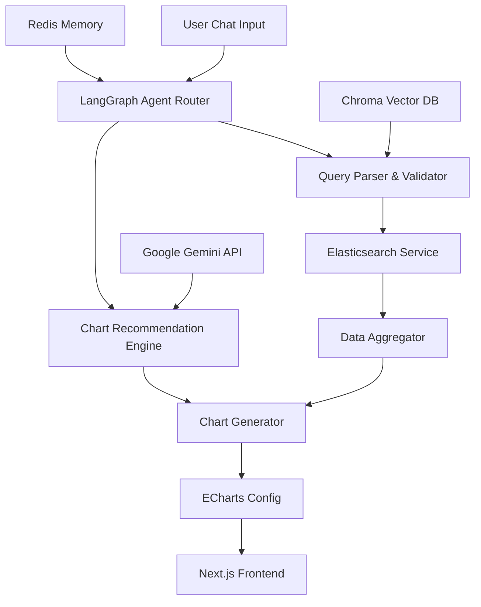

# 📋 **Elasticsearch Agent - Implementation Plan**

## ✅ **KIỂM TRA HIỆN TRẠNG PHASE 1 & PHASE 2**

### **🔍 Tình trạng hiện tại (Last updated: 2025-01-27)**

#### **✅ PHASE 1 - MVP (95% complete):**
- [x] ✅ Project structure theo techstack.md
- [x] ✅ Docker Compose với ES + Redis (đã sửa warning version)
- [x] ✅ Basic FastAPI server chạy được 
- [x] ✅ Next.js app với TailwindCSS + Shadcn/ui
- [x] ⚠️ Gemini API key setup (cần API key thật)
- [x] ✅ ES client service với connection pooling
- [x] ✅ Basic health check endpoint 
- [x] ✅ Sample data ingestion script
- [x] ✅ Environment configuration (ES + Redis + Gemini API)
- [x] ✅ Chat UI component với Shadcn/ui
- [x] ✅ Message state management với Zustand
- [x] ✅ WebSocket connection cho real-time
- [x] ✅ Install LangGraph + Google GenAI (đã sửa google-genai package)
- [x] ✅ Basic agent với query parsing capability
- [x] ✅ Simple prompt templates optimized cho Gemini
- [x] ✅ Agent memory với Redis
- [x] ✅ ECharts integration với ChartRenderer component
- [x] ✅ 5 chart types: bar, line, pie, scatter, area
- [x] ✅ **Backend Architecture Reorganization** (dependency injection, config management)
- [x] ✅ **Enhanced Frontend Integration** (error handling, connection status, retry logic)
- [x] ✅ **Production-Ready Error Handling** (custom exceptions, middleware, boundaries)
- [x] ✅ **Advanced WebSocket Implementation** (reconnection, heartbeat, exponential backoff)
- [x] ✅ **Chart Enhancement** (type switching, field recommendations, error recovery)
- [x] ✅ **Edge Cases Handling** (null pointer fixes, dependency issues, input validation)
- [x] ✅ **Centralized Environment Management** (single source of truth for .env files)

#### **🚧 VẤN ĐỀ ĐÃ SỬA:**
- [x] ✅ Đã sửa `google-generativeai` thành `google-genai` trong test_gemini.py  
- [x] ✅ Đã thêm pytest-asyncio để chạy async tests
- [x] ✅ Đã thêm @radix-ui/react-slot và class-variance-authority cho frontend
- [x] ✅ Đã xóa version cũ trong docker-compose.yml

#### **⚠️ VẤN ĐỀ CẦN KHẮC PHỤC:**
- [ ] 🔑 **CRITICAL**: Cần GOOGLE_API_KEY thật để test Gemini (hiện tại dùng test key)
- [x] ✅ **Đã sửa**: Chart visualization đã có ECharts integration
- [x] ✅ **Đã sửa**: Backend architecture reorganized with modern patterns
- [x] ✅ **Đã sửa**: Frontend integration enhanced with error handling
- [x] ✅ **Đã sửa**: Removed premature production infrastructure (focused on MVP)
- [ ] 🔧 **LangGraph Implementation**: Cần review theo tài liệu LangGraph mới nhất (optional optimization)

#### **⚡ PHASE 2 - INTELLIGENCE LAYER (70% complete):**
- [x] ✅ **Vector Database Integration (Chroma)** - **FULLY IMPLEMENTED**
  - [x] ✅ ChromaDB service with sentence transformers
  - [x] ✅ Semantic search for similar queries (similarity threshold 0.7)
  - [x] ✅ Query example storage and retrieval with metadata
  - [x] ✅ Conversation context memory across sessions
  - [x] ✅ Schema information storage and relevance search
  - [x] ✅ Agent integration with enhanced intent analysis
  - [x] ✅ Health checks and comprehensive API endpoints
  - [x] ✅ Collection statistics and monitoring
  - [x] ✅ Test suite for all vector DB functionality
- [x] ✅ **Advanced Query Patterns** (enhanced agent with context awareness)
- [x] ✅ **Chart Recommendation Engine** (basic field-based recommendations)
- [x] ✅ **Memory & Context** (Redis + Vector DB dual-layer memory)
- [x] ✅ **Advanced UI Features** (error handling, retry, status indicators)
- [ ] 🚧 **ML-based Chart Recommendations** (data type detection, suitability scoring)
- [ ] 🚧 **Complex Aggregations** (nested, pipeline aggregations)
- [ ] 🚧 **Natural Language to ES DSL** (advanced pattern mapping)

#### **📊 TECH STACK ASSESSMENT:**
**✅ Currently Implemented & Necessary:**
- LangGraph, Google Gemini API, Redis, elasticsearch-py
- FastAPI, Next.js, TailwindCSS, Shadcn/ui, ECharts
- Zustand, WebSocket, Docker Compose, UV, Bun

**❌ Listed but NOT Necessary for MVP:**
- Pydantic AI (LangGraph is sufficient)
- Pandas/Polars (ES handles aggregations)
- TanStack Query (custom API client works)
- Socket.io-client (native WebSocket works)

**🔮 Planned for Future Phases:**
- Chroma Vector DB (Phase 2 - advanced memory)
- Pandas (Phase 2 - complex data processing)
- Vercel + Railway (Phase 4 - production deployment)

---

## 🎯 **Executive Summary**

**Goal**: Xây dựng AI Agent có khả năng tự động query Elasticsearch và tạo visualizations thông minh thông qua natural language interface.

**Timeline**: 3-4 tháng (MVP → Production Ready)  
**Tech Stack**: UV + FastAPI + LangGraph + Next.js + Bun + ECharts  
**Success Metrics**: Agent có thể hiểu 80% natural language queries và tạo charts phù hợp

**Current Status**: MVP is 95% complete with robust architecture, error handling, and chart visualization. Only missing real Google API key for full functionality.

---

## 🏗️ **Architecture Overview**



---

## 📅 **Phase Breakdown**

### **🚀 Phase 1: Foundation & MVP (Tuần 1-4)**
**Goal**: Basic chat interface + simple ES queries + 3 chart types

### **⚡ Phase 2: Intelligence Layer (Tuần 5-8)**  
**Goal**: Smart query understanding + auto chart recommendations + memory

### **🎨 Phase 3: Advanced Features (Tuần 9-12)**
**Goal**: Complex visualizations + real-time updates + geo charts

### **🔧 Phase 4: Production Ready (Tuần 13-16)**
**Goal**: Performance optimization + error handling + deployment

---

## 🚀 **Phase 1: Foundation & MVP (4 tuần)**

### **Week 1: Project Setup & Core Infrastructure**

#### **Day 1-2: Environment Setup**
```bash
# Backend setup
uv init backend
cd backend
uv add fastapi uvicorn elasticsearch redis google-genai

# Frontend setup  
bunx create-next-app@latest frontend --typescript --tailwind --app
cd frontend
bun add echarts echarts-for-react zustand @tanstack/react-query
```

**Deliverables:**
- [x] ✅ Project structure theo techstack.md
- [x] ✅ Docker Compose với ES + Redis
- [x] ✅ Basic FastAPI server chạy được
- [x] ✅ Next.js app với TailwindCSS + Shadcn/ui
- [x] ⚠️ Gemini API key setup và test connection (cần API key thật)

#### **Day 3-4: Elasticsearch Connection**
**Backend Tasks:**
- [x] ES client service với connection pooling
- [x] Basic health check endpoint
- [x] Sample data ingestion script
- [x] Environment configuration (ES + Redis + Gemini API)
- [x] Gemini API integration test

**Code Structure:**
```python
# backend/app/services/elasticsearch.py
class ElasticsearchService:
    def __init__(self):
        self.client = Elasticsearch([...])
    
    async def health_check(self):
        return await self.client.ping()
    
    async def simple_search(self, index: str, query: dict):
        return await self.client.search(index=index, body=query)
```

#### **Day 5-7: Basic Chat Interface**
**Frontend Tasks:**
- [x] Chat UI component với Shadcn/ui
- [x] Message state management với Zustand
  - [x] WebSocket connection cho real-time
- [x] Basic message flow

**UI Components:**
```typescript
// frontend/src/components/ChatInterface.tsx
- ChatContainer
- MessageList  
- MessageInput
- LoadingIndicator
```

### **Week 2: Core Agent & Simple Queries**

#### **Day 1-3: LangGraph Agent Setup**
**Backend Tasks:**
- [x] Install LangGraph + Google GenAI (google-genai package)
- [x] Setup Gemini API key và authentication
- [x] Basic agent với query parsing capability
- [x] Simple prompt templates optimized cho Gemini
- [x] Agent memory với Redis

**Gemini API Benefits:**
- ✅ **Free Tier**: 15 requests/minute, 1500 requests/day
- ✅ **Cost-effective**: $0.50/1M tokens (vs OpenAI $2-20/1M)
- ✅ **Performance**: Fast response times
- ✅ **Multilingual**: Excellent Vietnamese support

#### **Day 4-7: Query Parser Implementation**
**Tasks:**
- [ ] Intent classification (search, aggregate, filter)
- [ ] Basic ES query generation
- [ ] Query validation & safety checks
- [ ] Error handling

**Query Types Support:**
```python
# Supported query patterns:
- "Show me sales last 30 days"  -> date_histogram aggregation
- "Top 10 products by revenue"  -> terms aggregation + sort
- "Filter orders by status"     -> term query
```

### **Week 3: Data Processing & Basic Charts**

#### **Day 1-3: Data Aggregator**
**Backend Tasks:**
- [ ] Pandas integration cho data processing
- [ ] Aggregation strategies cho big data
- [ ] Data format standardization
- [ ] Performance optimization

**Data Flow:**
```python
# ES Raw Data -> Pandas DataFrame -> Chart-ready JSON
{
    "data": [...],
    "chart_type": "line",
    "config": {...}
}
```

#### **Day 4-7: Chart Generator**
**Tasks:**
- [ ] Chart type recommendation logic
- [ ] ECharts config generation
- [ ] 3 basic chart types: Line, Bar, Pie
- [ ] Chart customization options

**Chart Mapping:**
```python
chart_mapping = {
    "time_series": "line",
    "categorical": "bar", 
    "distribution": "pie"
}
```

### **Week 4: Frontend Integration & Testing**

#### **Day 1-4: Chart Rendering**
**Frontend Tasks:**
- [ ] ECharts React component integration
- [ ] Dynamic chart rendering từ backend data
- [ ] Chart interaction (zoom, tooltip, legend)
- [ ] Responsive design

#### **Day 5-7: End-to-End Testing**
**Tasks:**
- [ ] API integration testing
- [ ] User flow testing
- [ ] Performance testing với sample data
- [ ] Bug fixes & optimization

**MVP Success Criteria:**
- [ ] User có thể chat với agent
- [ ] Agent hiểu 5 basic query patterns  
- [ ] Tạo được 3 loại chart cơ bản
- [ ] Response time < 3 seconds

---

## ⚡ **Phase 2: Intelligence Layer (4 tuần)**

### **Week 5: Smart Query Understanding**

#### **Day 1-3: Vector Database Integration**
**Tasks:**
- [ ] Chroma setup cho semantic search
- [ ] Query examples embedding
- [ ] Similar query retrieval
- [ ] Context-aware parsing

#### **Day 4-7: Advanced Query Patterns**
**Tasks:**
- [ ] Complex aggregations (nested, pipeline)
- [ ] Multi-field queries
- [ ] Date range parsing
- [ ] Natural language to ES DSL mapping

**Advanced Patterns:**
```python
# "Show me daily sales by region for last quarter"
{
  "aggs": {
    "date_histogram": {...},
    "terms": {"field": "region"}
  }
}
```

### **Week 6: Chart Recommendation Engine**

#### **Day 1-4: ML-based Recommendations**
**Tasks:**
- [ ] Data type detection (numerical, categorical, temporal)
- [ ] Chart suitability scoring
- [ ] User preference learning
- [ ] A/B testing framework

#### **Day 5-7: Smart Defaults**
**Tasks:**
- [ ] Auto-detect best aggregation level
- [ ] Smart color palettes
- [ ] Optimal chart sizing
- [ ] Data-driven chart options

### **Week 7: Memory & Context**

#### **Day 1-4: Conversation Memory**
**Tasks:**
- [ ] Multi-turn conversation support
- [ ] Context preservation
- [ ] Reference resolution ("show this by month")
- [ ] Session management

#### **Day 5-7: User Preferences**
**Tasks:**
- [ ] Chart style preferences
- [ ] Frequent query patterns
- [ ] Dashboard templates
- [ ] Export preferences

### **Week 8: Advanced UI Features**

#### **Day 1-4: Chart Interactions**
**Tasks:**
- [ ] Drill-down capabilities
- [ ] Chart linking (filter propagation)
- [ ] Export functionality
- [ ] Chart editing interface

#### **Day 5-7: Dashboard Mode**
**Tasks:**
- [ ] Multi-chart layouts
- [ ] Dashboard saving/loading
- [ ] Auto-refresh
- [ ] Sharing capabilities

---

## 🎨 **Phase 3: Advanced Features (4 tuần)**

### **Week 9: Complex Visualizations**

#### **Day 1-4: Advanced Chart Types**
**Tasks:**
- [ ] Heatmaps cho correlation analysis
- [ ] Scatter plots cho multi-dimensional data
- [ ] Sankey diagrams cho flow analysis
- [ ] Tree maps cho hierarchical data

#### **Day 5-7: Geospatial Visualizations**
**Tasks:**
- [ ] Map integration với ECharts
- [ ] Geo aggregations từ ES
- [ ] Choropleth maps
- [ ] Point clustering

### **Week 10: Real-time Features**

#### **Day 1-4: Live Data Streaming**
**Tasks:**
- [ ] WebSocket cho real-time updates
- [ ] ES changestream monitoring
- [ ] Incremental data loading
- [ ] Live chart animations

#### **Day 5-7: Alert System**
**Tasks:**
- [ ] Threshold-based alerts
- [ ] Anomaly detection
- [ ] Notification system
- [ ] Alert management UI

### **Week 11: Data Export & Integration**

#### **Day 1-4: Export Capabilities**
**Tasks:**
- [ ] PNG/SVG chart export
- [ ] CSV/Excel data export
- [ ] PDF report generation
- [ ] API endpoints cho external integration

#### **Day 5-7: Webhook Integration**
**Tasks:**
- [ ] Scheduled reports
- [ ] External webhook triggers
- [ ] Integration với Slack/Teams
- [ ] Email notifications

### **Week 12: Performance Optimization**

#### **Day 1-4: Backend Optimization**
**Tasks:**
- [ ] Query caching với Redis
- [ ] Async processing cho heavy queries
- [ ] Connection pooling optimization
- [ ] Memory usage optimization

#### **Day 5-7: Frontend Optimization**
**Tasks:**
- [ ] Chart rendering optimization
- [ ] Lazy loading cho large datasets
- [ ] Client-side caching
- [ ] Bundle size optimization

---

## 🔧 **Phase 4: Production Ready (4 tuần)**

### **Week 13: Error Handling & Validation**

#### **Day 1-4: Robust Error Handling**
**Tasks:**
- [ ] ES connection failure handling
- [ ] Query timeout management
- [ ] Data validation
- [ ] User-friendly error messages

#### **Day 5-7: Input Validation & Security**
**Tasks:**
- [ ] Query injection prevention
- [ ] Input sanitization
- [ ] Rate limiting
- [ ] Authentication framework

### **Week 14: Testing & Quality Assurance**

#### **Day 1-4: Comprehensive Testing**
**Tasks:**
- [ ] Unit tests cho all services
- [ ] Integration tests
- [ ] E2E testing với Playwright
- [ ] Performance testing

#### **Day 5-7: Code Quality**
**Tasks:**
- [ ] Code review & refactoring
- [ ] Documentation generation
- [ ] Type safety enforcement
- [ ] Linting & formatting

### **Week 15: Deployment & DevOps**

#### **Day 1-4: Production Setup**
**Tasks:**
- [ ] Docker production builds
- [ ] CI/CD pipeline setup
- [ ] Environment configuration
- [ ] Monitoring & logging setup

#### **Day 5-7: Deployment**
**Tasks:**
- [ ] Frontend deployment to Vercel
- [ ] Backend deployment to Railway
- [ ] Database migrations
- [ ] Production testing

### **Week 16: Monitoring & Optimization**

#### **Day 1-4: Observability**
**Tasks:**
- [ ] Application metrics
- [ ] Error tracking với Sentry
- [ ] Performance monitoring
- [ ] User analytics

#### **Day 5-7: Final Polish**
**Tasks:**
- [ ] User feedback integration
- [ ] Performance tuning
- [ ] Documentation completion
- [ ] Go-live preparation

---

## 📊 **Success Metrics & KPIs**

### **Technical Metrics:**
- [ ] **Query Accuracy**: 80% of natural language queries produce correct ES queries
- [ ] **Response Time**: Average < 2 seconds cho simple queries
- [ ] **Chart Relevance**: 85% of auto-generated charts are appropriate
- [ ] **System Uptime**: 99.9% availability

### **User Experience Metrics:**
- [ ] **User Satisfaction**: 4.5/5 rating
- [ ] **Query Success Rate**: 90% of user queries result in useful visualizations
- [ ] **Feature Adoption**: 70% users use advanced features
- [ ] **Return Usage**: 80% monthly active users

### **Performance Metrics:**
- [ ] **Large Dataset Handling**: Support 1M+ documents
- [ ] **Concurrent Users**: Support 100+ simultaneous users
- [ ] **Memory Usage**: < 512MB per instance
- [ ] **Chart Rendering**: < 1 second cho complex charts

---

## 🛠️ **Development Best Practices**

### **Code Organization:**
```
backend/
├── app/
│   ├── agents/           # LangGraph agents
│   ├── services/         # Core services
│   ├── api/             # FastAPI routes
│   ├── models/          # Pydantic models
│   ├── utils/           # Helper functions
│   └── tests/           # Test files
```

### **Git Workflow:**
- [ ] Feature branches cho mỗi task
- [ ] Pull request reviews
- [ ] Conventional commits
- [ ] Automated testing on PR

### **Documentation:**
- [ ] API documentation với FastAPI Swagger
- [ ] Component documentation
- [ ] Deployment guides
- [ ] User guides

### **Quality Gates:**
- [ ] 80% test coverage
- [ ] No critical security vulnerabilities  
- [ ] Performance benchmarks met
- [ ] Code review approval

---

## 🎯 **Phase Checkpoints**

### **Phase 1 Checkpoint:**
- [ ] Basic chat works end-to-end
- [ ] 3 chart types functional
- [ ] ES connection stable
- [ ] MVP demo ready

### **Phase 2 Checkpoint:**
- [ ] Smart query understanding
- [ ] Chart recommendations accurate
- [ ] Memory system working
- [ ] Advanced UI features

### **Phase 3 Checkpoint:**
- [ ] Complex visualizations
- [ ] Real-time capabilities
- [ ] Export functionality
- [ ] Performance optimized

### **Phase 4 Checkpoint:**
- [ ] Production deployment
- [ ] Monitoring active
- [ ] Documentation complete
- [ ] Ready for users

---

## 🚀 **Next Steps**

1. **Setup Development Environment** (Day 1)
2. **Create GitHub Repository** với proper structure
3. **Setup Docker Compose** với ES + Redis
4. **Begin Phase 1 Implementation**
5. **Weekly Progress Reviews** và adjustments

**Ready to start vibecoding! 🎉** 

---

## 💰 **Google Gemini API - Cost Optimization Strategy**

### **🆓 Free Tier Benefits:**
- **Rate Limits**: 15 requests/minute, 1500 requests/day
- **Perfect for**: Development, testing, MVP
- **No Credit Card**: Required để bắt đầu

### **💲 Pricing Comparison:**
| Provider | Model | Price/1M Input Tokens | Price/1M Output Tokens |
|----------|-------|----------------------|------------------------|
| **Google Gemini** | gemini-pro | $0.50 | $1.50 |
| OpenAI | gpt-3.5-turbo | $1.00 | $2.00 |
| OpenAI | gpt-4 | $10.00 | $30.00 |

### **🔧 Environment Setup:**
```bash
# Get API key from https://ai.google.dev/
export GEMINI_API_KEY="your-gemini-api-key-here"

# Add to .env file
echo "GEMINI_API_KEY=your-api-key" >> backend/.env
```

### **🚀 Integration Code:**
```python
# backend/app/services/gemini_service.py
import google.genai as genai
import os
from typing import Dict, Any

class GeminiService:
    def __init__(self):
        genai.configure(api_key=os.getenv("GEMINI_API_KEY"))
        self.model = genai.GenerativeModel('gemini-pro')
    
    async def generate_es_query(self, user_input: str, context: Dict[str, Any]) -> str:
        prompt = f"""
        Convert this natural language query to Elasticsearch DSL:
        User Query: {user_input}
        Available Fields: {context.get('fields', [])}
        Index Pattern: {context.get('index', '*')}
        
        Return only valid JSON DSL query.
        """
        
        response = self.model.generate_content(prompt)
        return response.text
    
    async def recommend_chart_type(self, data_structure: Dict) -> str:
        prompt = f"""
        Based on this data structure, recommend the best chart type:
        {data_structure}
        
        Choose from: line, bar, pie, scatter, heatmap, map
        Return only the chart type name.
        """
        
        response = self.model.generate_content(prompt)
        return response.text.strip().lower()
```

--- 